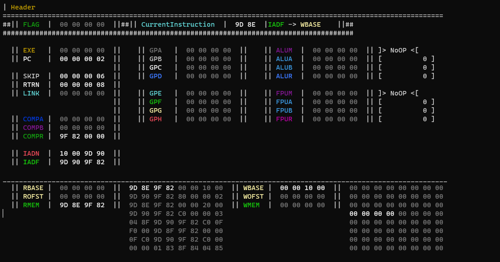

# nlogic

This is the full desktop simulator for the `nlogic` ISA.

### Background
`nlogic` is a novel assembly instruction set I created to experiment with language and operating system design. In high school, before I knew much about processors,
I asked myself "how do you think a processor works? What does it need to be able to do to run programs?". I wrote down my answer in a word document and forgot about it.

Years later, after taking computer architecture and OS classes in college, I rediscovered that document and wondered if it would be feasible as a computer system.
After some small additions, this is the result (it works!).

The processor was designed to follow the spirit of that original plan as closely as possible, and with a goal of supporting interrupts, virtual memory, and time-sharing.
I have been planning and implementing an operating system for a while, and a small amount of that work is available in this repository, too.
The processor and simulation also support breakpoints, a visualizer with line-by-line stepping, virtual disk and other input/output devices, and user-mode interrupt handlers.

_Running an example program with the processor visualizer enabled_

### Documentation & Demo
Documentation and an online demo of a simpler version of the simulator is available at https://nobear.io/

### Some interesting files
- [`AssembleDebug.py`](https://github.com/nbearman/nlogic/blob/master/AssembleDebug.py)
  - The newest version of the assembler; besides bytecode, can also output debug versions of the source files, annotated with the virtual address on each line
- [`processor/Processor3.cs`](https://github.com/nbearman/nlogic/blob/master/processor/Processor3.cs)
  - Main instruction execution logic
- [`simluation_environment/SimulationEnvironment.cs`](https://github.com/nbearman/nlogic/blob/master/simulation_environment/SimulationEnvironment.cs)
  - Interconnect between the processor, memory, input/output devices, and other hardware on in the system
- [`devices/MemoryManagementUnit.cs`](https://github.com/nbearman/nlogic/blob/master/devices/MemoryManagementUnit.cs)
  - The memory management unit (MMU), virtual device that underpins virtual memory
- [`/DISK_DEBUG/`](https://github.com/nbearman/nlogic/tree/master/DISK_DEBUG/64)
  - Example output of the debug disk builder, which creates the virtual storage for the system and annotates source files
- [`documentation/Readme.txt`](https://github.com/nbearman/nlogic/blob/master/documentation/Readme.txt)
  - Some information for running the bash scripts to develop for `nlogic`; originally notes for myself, they aren't very thorough guides
